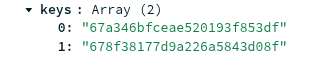
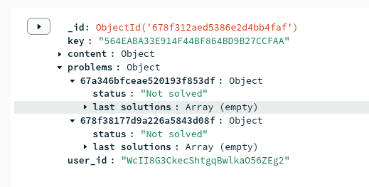
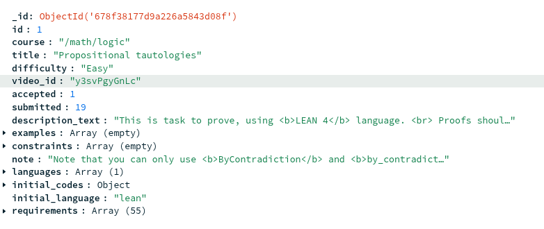
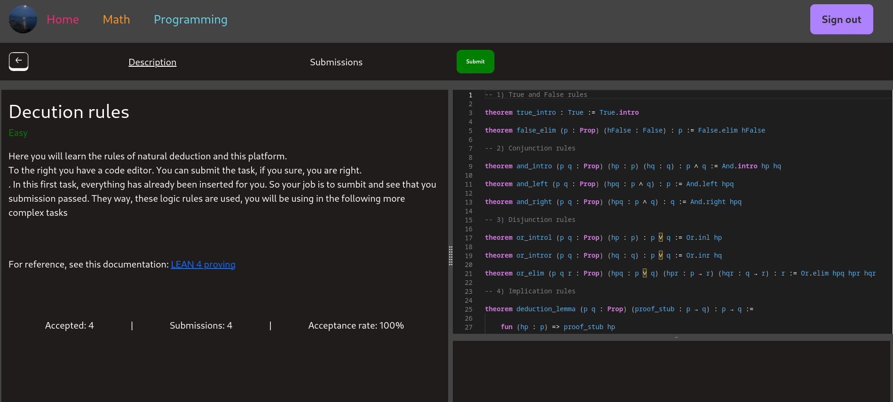
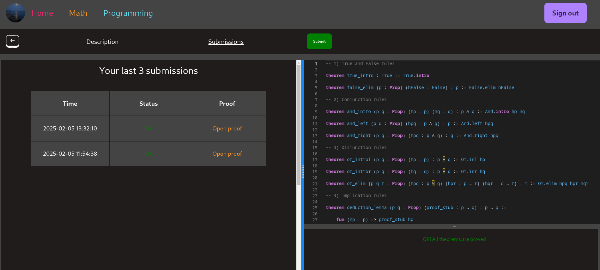

# bestcodeio

Online judge web application

1) First install the following images:

[gcc](https://hub.docker.com/_/gcc)
[lean](https://github.com/IgorAmashukeli/Bestcode/blob/main/DockerLEAN/Dockerfile)

The first one should be named gcc
The second should be named lean_image

! Don't create any containers before running the application.
The application assumes no containers were created prior running

2) Add your firebase config to /AngProject/src/app/environments/environment.development.ts as well as to /AngProject/src/app/environment.development.ts

3) Add your MongoDB uri to uri.js in the root

4) Create BestCode DB with 3 collections: Users, ProblemKeys and Problems

5) ProblemKeys should contain one document with list of all the keys (ObjectId):

6) Typical User document:

7) Typical Problem documet:

8) Try to use add_problems.js in problemAdding to configure your database documention, according to the way it is explained above

(you should documents with exactly same structure)

(you can see examples of problems in output0.json)

9) If everything is configured, you will be able to run and submit tasks.

Here is example of math problem:

